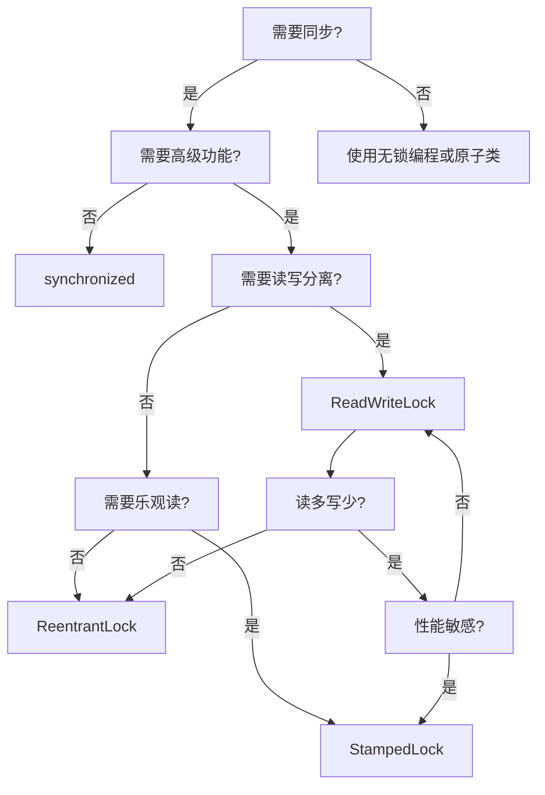

# Java锁机制教程

## 目录
1. [概述](#概述)
2. [synchronized关键字](#synchronized关键字)
3. [ReentrantLock](#reentrantlock)
4. [ReadWriteLock](#readwritelock)
5. [StampedLock](#stampedlock)
6. [同步工具类](#同步工具类)
7. [Condition条件变量](#condition条件变量)
8. [锁的选择指南](#锁的选择指南)
9. [性能优化建议](#性能优化建议)

## 概述

Java提供了丰富的锁机制来解决多线程并发问题。这些锁机制可以分为以下几类：

- **内置锁（Intrinsic Lock）**：synchronized关键字
- **显式锁（Explicit Lock）**：java.util.concurrent.locks包中的锁
- **同步工具类**：CountDownLatch、CyclicBarrier、Semaphore等

### 锁的分层结构


### 锁的核心概念

1. **互斥性（Mutual Exclusion）**：同一时间只有一个线程可以获得锁
2. **可重入性（Reentrancy）**：同一线程可以多次获取同一个锁
3. **公平性（Fairness）**：等待时间最长的线程优先获得锁
4. **可中断性（Interruptibility）**：等待锁的线程可以被中断
5. **超时机制（Timeout）**：尝试获取锁时可以设置超时时间

## synchronized关键字

synchronized是Java最基本的同步机制，它基于对象的内置锁（monitor lock）。

### 使用方式

```java
// 1. 同步方法
public synchronized void method() {
    // 临界区代码
}

// 2. 同步代码块
public void method() {
    synchronized (this) {
        // 临界区代码
    }
}

// 3. 静态同步方法（类锁）
public static synchronized void staticMethod() {
    // 临界区代码
}

// 4. 类锁
public void method() {
    synchronized (MyClass.class) {
        // 临界区代码
    }
}
```

### synchronized的工作原理


### 优点
- 使用简单，语法清晰
- JVM层面优化，性能不断改进
- 自动获取和释放锁，不会忘记释放
- 支持重入

### 缺点
- 不支持中断
- 不支持超时
- 不支持非阻塞获取
- 无法实现公平锁

## ReentrantLock

ReentrantLock是Lock接口的实现，提供了比synchronized更多的功能。

### 基本用法

```java
ReentrantLock lock = new ReentrantLock();

try {
    lock.lock();
    // 临界区代码
} finally {
    lock.unlock(); // 必须在finally中释放
}
```

### 高级功能

```java
// 1. 尝试获取锁（非阻塞）
if (lock.tryLock()) {
    try {
        // 临界区代码
    } finally {
        lock.unlock();
    }
}

// 2. 超时获取锁
if (lock.tryLock(5, TimeUnit.SECONDS)) {
    try {
        // 临界区代码
    } finally {
        lock.unlock();
    }
}

// 3. 可中断的锁获取
try {
    lock.lockInterruptibly();
    try {
        // 临界区代码
    } finally {
        lock.unlock();
    }
} catch (InterruptedException e) {
    // 处理中断
}

// 4. 公平锁
ReentrantLock fairLock = new ReentrantLock(true);
```

### ReentrantLock vs synchronized

| 特性 | synchronized | ReentrantLock |
|------|--------------|---------------|
| 获取锁方式 | 自动 | 手动调用lock() |
| 释放锁方式 | 自动 | 手动调用unlock() |
| 可中断性 | 不支持 | 支持 |
| 超时机制 | 不支持 | 支持 |
| 公平性 | 非公平 | 可选择公平/非公平 |
| 条件变量 | 1个(wait/notify) | 多个(Condition) |
| 性能 | JVM优化 | 显式锁开销 |

## ReadWriteLock

ReadWriteLock维护了一对锁：读锁和写锁。读锁可以被多个读线程同时持有，写锁是排他的。

### 锁的兼容性

| 当前持有锁 | 读锁请求 | 写锁请求 |
|-----------|---------|---------|
| 无锁 | ✅ | ✅ |
| 读锁 | ✅ | ❌ |
| 写锁 | ❌ | ❌ |

### 使用示例

```java
ReadWriteLock rwLock = new ReentrantReadWriteLock();
Lock readLock = rwLock.readLock();
Lock writeLock = rwLock.writeLock();

// 读操作
readLock.lock();
try {
    // 读取共享数据
} finally {
    readLock.unlock();
}

// 写操作
writeLock.lock();
try {
    // 修改共享数据
} finally {
    writeLock.unlock();
}
```

### 锁降级

```java
writeLock.lock();
try {
    // 修改数据
    data = newValue;
    
    // 获取读锁（锁降级）
    readLock.lock();
    try {
        writeLock.unlock(); // 释放写锁
        // 现在只持有读锁，其他线程也可以读取
        processData(data);
    } finally {
        readLock.unlock();
    }
} catch (Exception e) {
    writeLock.unlock();
}
```

### 适用场景
- 读多写少的场景
- 缓存系统
- 配置信息的读取和更新

## StampedLock

StampedLock是Java 8引入的新锁，提供了三种模式：写锁、悲观读锁、乐观读锁。

### 三种锁模式


### 使用示例

```java
StampedLock sl = new StampedLock();

// 乐观读
long stamp = sl.tryOptimisticRead();
// 读取数据
int x = this.x, y = this.y;
if (!sl.validate(stamp)) {
    // 乐观读失败，降级为悲观读
    stamp = sl.readLock();
    try {
        x = this.x;
        y = this.y;
    } finally {
        sl.unlockRead(stamp);
    }
}

// 写锁
long writeStamp = sl.writeLock();
try {
    this.x = newX;
    this.y = newY;
} finally {
    sl.unlockWrite(writeStamp);
}
```

### 性能优势

StampedLock的乐观读不会阻塞写操作，在读多写少的场景下性能优于ReadWriteLock。


## 同步工具类

### CountDownLatch

倒计时门闩，用于等待一组线程完成操作。

```java
CountDownLatch latch = new CountDownLatch(3);

// 工作线程
for (int i = 0; i < 3; i++) {
    new Thread(() -> {
        try {
            // 执行工作
            doWork();
        } finally {
            latch.countDown(); // 计数减1
        }
    }).start();
}

// 主线程等待
latch.await(); // 等待计数归零
```

### CyclicBarrier

循环屏障，让一组线程互相等待，直到都到达屏障点。

```java
CyclicBarrier barrier = new CyclicBarrier(3, () -> {
    System.out.println("所有线程都到达屏障点");
});

for (int i = 0; i < 3; i++) {
    new Thread(() -> {
        try {
            // 第一阶段工作
            doPhase1();
            barrier.await(); // 等待其他线程
            
            // 第二阶段工作
            doPhase2();
            barrier.await(); // 再次等待
        } catch (Exception e) {
            e.printStackTrace();
        }
    }).start();
}
```

### Semaphore

信号量，控制对资源的并发访问数量。

```java
Semaphore semaphore = new Semaphore(3); // 允许3个线程同时访问

semaphore.acquire(); // 获取许可证
try {
    // 访问受限资源
    accessResource();
} finally {
    semaphore.release(); // 释放许可证
}
```

### 同步工具类对比

| 工具类 | 用途 | 可重用 | 等待方式 |
|--------|------|-------|---------|
| CountDownLatch | 等待一组线程完成 | 否 | 一个或多个线程等待 |
| CyclicBarrier | 线程间互相等待 | 是 | 所有线程互相等待 |
| Semaphore | 控制并发数量 | 是 | 获取许可证 |

## Condition条件变量

Condition提供了比wait/notify更灵活的线程协调机制。

### 基本用法

```java
ReentrantLock lock = new ReentrantLock();
Condition condition = lock.newCondition();

// 等待条件
lock.lock();
try {
    while (!conditionMet) {
        condition.await();
    }
    // 条件满足后的处理
} finally {
    lock.unlock();
}

// 通知条件变化
lock.lock();
try {
    conditionMet = true;
    condition.signal(); // 或signalAll()
} finally {
    lock.unlock();
}
```

### 生产者消费者模式

```java
class BoundedBuffer<T> {
    private final Queue<T> queue = new ArrayDeque<>();
    private final int capacity;
    private final ReentrantLock lock = new ReentrantLock();
    private final Condition notFull = lock.newCondition();
    private final Condition notEmpty = lock.newCondition();
    
    public void put(T item) throws InterruptedException {
        lock.lock();
        try {
            while (queue.size() == capacity) {
                notFull.await(); // 等待非满条件
            }
            queue.offer(item);
            notEmpty.signal(); // 通知非空条件
        } finally {
            lock.unlock();
        }
    }
    
    public T take() throws InterruptedException {
        lock.lock();
        try {
            while (queue.isEmpty()) {
                notEmpty.await(); // 等待非空条件
            }
            T item = queue.poll();
            notFull.signal(); // 通知非满条件
            return item;
        } finally {
            lock.unlock();
        }
    }
}
```

## 锁的选择指南

### 选择流程图



### 使用建议

1. **首选synchronized**：简单场景下优先使用
2. **ReentrantLock**：需要高级功能时使用
3. **ReadWriteLock**：读多写少场景
4. **StampedLock**：性能要求极高的读多写少场景
5. **同步工具类**：适合复杂的线程协调

## 性能优化建议

### 1. 减少锁的粒度

```java
// 粗粒度锁（不推荐）
synchronized (this) {
    updateFieldA();
    updateFieldB();
    updateFieldC();
}

// 细粒度锁（推荐）
synchronized (lockA) { updateFieldA(); }
synchronized (lockB) { updateFieldB(); }
synchronized (lockC) { updateFieldC(); }
```

### 2. 减少锁的持有时间

```java
// 锁持有时间长（不推荐）
synchronized (this) {
    complexCalculation();
    updateSharedData();
    anotherComplexOperation();
}

// 锁持有时间短（推荐）
Result result = complexCalculation();
synchronized (this) {
    updateSharedData(result);
}
anotherComplexOperation();
```

### 3. 使用读写锁分离

```java
// 所有操作都使用写锁（不推荐）
synchronized void read() { return data; }
synchronized void write(Data data) { this.data = data; }

// 读写分离（推荐）
ReadWriteLock rwLock = new ReentrantReadWriteLock();

Data read() {
    rwLock.readLock().lock();
    try {
        return data;
    } finally {
        rwLock.readLock().unlock();
    }
}
```

### 4. 避免死锁

```java
// 死锁风险（不推荐）
synchronized (lock1) {
    synchronized (lock2) {
        // 操作
    }
}

// 使用顺序锁（推荐）
Object firstLock = System.identityHashCode(lock1) < System.identityHashCode(lock2) ? lock1 : lock2;
Object secondLock = firstLock == lock1 ? lock2 : lock1;

synchronized (firstLock) {
    synchronized (secondLock) {
        // 操作
    }
}
```

### 5. 使用无锁数据结构

```java
// 有锁实现
private int count = 0;
synchronized int increment() {
    return ++count;
}

// 无锁实现
private AtomicInteger count = new AtomicInteger(0);
int increment() {
    return count.incrementAndGet();
}
```

### 6. 锁消除和锁粗化

JVM会自动进行锁优化：

- **锁消除**：对于不会逃逸的对象，JVM会消除synchronized
- **锁粗化**：对于连续的同步操作，JVM会合并为一个更大的同步块
- **偏向锁**：对于只有一个线程访问的锁，优化为偏向锁
- **轻量级锁**：在没有竞争时使用CAS代替重量级锁

## LMAX Disruptor：高性能无锁框架

### 简介

LMAX Disruptor是一个高性能的线程间通信库，由英国外汇交易公司LMAX开发。它通过环形缓冲区(Ring Buffer)和预分配对象的方式，实现了极高的吞吐量和极低的延迟，是传统锁机制的强有力替代方案。

### 核心概念


### 关键组件

1. **Ring Buffer（环形缓冲区）**
   - 预分配固定数量的事件对象
   - 大小必须是2的幂
   - 通过序列号管理访问

2. **Event（事件）**
   - 承载业务数据的对象
   - 在Ring Buffer中循环使用

3. **EventFactory（事件工厂）**
   - 负责创建和初始化事件对象

4. **EventHandler（事件处理器）**
   - 定义如何处理事件的业务逻辑

5. **Producer（生产者）**
   - 发布事件到Ring Buffer

6. **Consumer（消费者）**
   - 处理Ring Buffer中的事件

7. **WaitStrategy（等待策略）**
   - 定义消费者等待新事件的方式

### 基本用法

#### 1. 定义事件类

```java
public class LongEvent {
    private long value;
    
    public void set(long value) {
        this.value = value;
    }
    
    public long getValue() {
        return value;
    }
}
```

#### 2. 创建事件工厂

```java
public class LongEventFactory implements EventFactory<LongEvent> {
    @Override
    public LongEvent newInstance() {
        return new LongEvent();
    }
}
```

#### 3. 创建事件处理器

```java
public class LongEventHandler implements EventHandler<LongEvent> {
    @Override
    public void onEvent(LongEvent event, long sequence, boolean endOfBatch) {
        System.out.println("处理事件: " + event.getValue());
    }
}
```

#### 4. 创建和启动Disruptor

```java
// 创建Disruptor
int bufferSize = 1024; // 必须是2的幂
Disruptor<LongEvent> disruptor = new Disruptor<>(
    new LongEventFactory(),
    bufferSize,
    DaemonThreadFactory.INSTANCE,
    ProducerType.SINGLE,
    new BlockingWaitStrategy()
);

// 设置事件处理器
disruptor.handleEventsWith(new LongEventHandler());

// 启动Disruptor
disruptor.start();

// 获取Ring Buffer
RingBuffer<LongEvent> ringBuffer = disruptor.getRingBuffer();
```

#### 5. 发布事件

```java
// 方式1：使用EventTranslator
ringBuffer.publishEvent((event, sequence, value) -> event.set(value), 123L);

// 方式2：直接操作
long sequence = ringBuffer.next();
try {
    LongEvent event = ringBuffer.get(sequence);
    event.set(123L);
} finally {
    ringBuffer.publish(sequence);
}
```

### 等待策略对比

| 策略 | CPU占用 | 延迟 | 适用场景 |
|------|---------|------|----------|
| BlockingWaitStrategy | 低 | 高 | CPU资源紧张，对延迟要求不高 |
| YieldingWaitStrategy | 中 | 中 | 平衡CPU使用和延迟 |
| BusySpinWaitStrategy | 高 | 低 | 对延迟要求极高，CPU资源充足 |
| SleepingWaitStrategy | 最低 | 最高 | 对延迟要求很低的场景 |

### 消费者模式

#### 1. 多个独立消费者

```java
// 每个消费者都会处理所有事件
disruptor.handleEventsWith(handler1, handler2, handler3);
```

#### 2. 消费者链

```java
// 事件按顺序经过每个消费者
disruptor.handleEventsWith(handler1)
        .then(handler2)
        .then(handler3);
```

#### 3. 工作池模式

```java
// 多个消费者共同处理事件（负载均衡）
disruptor.handleEventsWithWorkerPool(worker1, worker2, worker3);
```

### 性能优势

1. **无锁设计**：避免了锁竞争的开销
2. **预分配内存**：减少GC压力
3. **CPU缓存友好**：环形缓冲区的顺序访问模式
4. **批量处理**：支持事件批量处理
5. **零拷贝**：事件对象在Ring Buffer中循环使用

### 性能对比

在高并发场景下，Disruptor相比传统的BlockingQueue通常有以下性能提升：

- **吞吐量**：5-10倍提升
- **延迟**：显著降低，特别是99.9%分位数延迟
- **CPU使用率**：更高效的CPU利用

### 使用场景

1. **高频交易系统**：金融交易、订单处理
2. **实时数据处理**：日志处理、事件流处理
3. **游戏服务器**：玩家事件处理
4. **高性能消息系统**：消息队列、事件总线
5. **大数据处理**：实时分析、流式计算

### 最佳实践

1. **合理设置Ring Buffer大小**
   ```java
   // 通常设置为2的幂，如1024, 2048, 4096等
   int bufferSize = 1024;
   ```

2. **选择合适的等待策略**
   ```java
   // 低延迟场景
   new BusySpinWaitStrategy()
   
   // 平衡场景
   new YieldingWaitStrategy()
   
   // 低CPU场景
   new BlockingWaitStrategy()
   ```

3. **处理异常**
   ```java
   disruptor.setDefaultExceptionHandler(new ExceptionHandler<LongEvent>() {
       @Override
       public void handleEventException(Throwable ex, long sequence, LongEvent event) {
           logger.error("处理事件异常", ex);
       }
   });
   ```

4. **优雅关闭**
   ```java
   disruptor.shutdown();
   ```

## ThreadLocal：线程本地存储

### 概述

ThreadLocal提供了线程本地存储机制，每个线程都有自己独立的变量副本。这是一种避免同步的重要技术，常用于保存线程上下文信息。

### 核心概念


### 基本用法

#### 1. 创建ThreadLocal变量

```java
// 基本创建方式
private static final ThreadLocal<String> threadLocal = new ThreadLocal<>();

// 带初始值的创建方式
private static final ThreadLocal<Integer> counter = ThreadLocal.withInitial(() -> 0);

// 自定义初始化
private static final ThreadLocal<Connection> connectionHolder = new ThreadLocal<Connection>() {
    @Override
    protected Connection initialValue() {
        return createDatabaseConnection();
    }
};
```

#### 2. 使用ThreadLocal

```java
public class ThreadLocalExample {
    private static final ThreadLocal<String> userContext = new ThreadLocal<>();
    
    public void processRequest(String userId) {
        try {
            // 设置线程上下文
            userContext.set(userId);
            
            // 业务处理中可以随时获取
            doBusinessLogic();
            
        } finally {
            // 重要：清理ThreadLocal防止内存泄漏
            userContext.remove();
        }
    }
    
    private void doBusinessLogic() {
        String currentUser = userContext.get();
        // 使用当前用户信息处理业务逻辑
        System.out.println("处理用户 " + currentUser + " 的请求");
    }
}
```

### InheritableThreadLocal

InheritableThreadLocal允许子线程继承父线程的ThreadLocal值：

```java
public class InheritableExample {
    private static final InheritableThreadLocal<String> inheritableContext = 
        new InheritableThreadLocal<>();
    
    public void parentThreadMethod() {
        inheritableContext.set("父线程的值");
        
        // 创建子线程
        new Thread(() -> {
            // 子线程可以访问父线程设置的值
            String inherited = inheritableContext.get(); // "父线程的值"
            System.out.println("子线程继承的值: " + inherited);
        }).start();
    }
}
```

### 常见使用场景

#### 1. 用户上下文管理

```java
public class UserContext {
    private static final ThreadLocal<User> currentUser = new ThreadLocal<>();
    
    public static void setCurrentUser(User user) {
        currentUser.set(user);
    }
    
    public static User getCurrentUser() {
        return currentUser.get();
    }
    
    public static void clear() {
        currentUser.remove();
    }
}

// 在Web过滤器中设置用户上下文
public class UserContextFilter implements Filter {
    @Override
    public void doFilter(ServletRequest request, ServletResponse response, 
                        FilterChain chain) throws IOException, ServletException {
        try {
            User user = getUserFromRequest(request);
            UserContext.setCurrentUser(user);
            chain.doFilter(request, response);
        } finally {
            UserContext.clear(); // 请求结束时清理
        }
    }
}
```

#### 2. 数据库连接管理

```java
public class ConnectionManager {
    private static final ThreadLocal<Connection> connectionHolder = 
        ThreadLocal.withInitial(() -> {
            try {
                return DriverManager.getConnection(
                    "jdbc:mysql://localhost:3306/test", "user", "password");
            } catch (SQLException e) {
                throw new RuntimeException(e);
            }
        });
    
    public static Connection getConnection() {
        return connectionHolder.get();
    }
    
    public static void closeConnection() {
        Connection conn = connectionHolder.get();
        if (conn != null) {
            try {
                conn.close();
            } catch (SQLException e) {
                // 处理异常
            }
            connectionHolder.remove();
        }
    }
}
```

#### 3. 线程安全的日期格式化

```java
public class DateUtils {
    // SimpleDateFormat不是线程安全的，使用ThreadLocal解决
    private static final ThreadLocal<SimpleDateFormat> dateFormat = 
        ThreadLocal.withInitial(() -> new SimpleDateFormat("yyyy-MM-dd HH:mm:ss"));
    
    public static String formatDate(Date date) {
        return dateFormat.get().format(date);
    }
    
    public static Date parseDate(String dateStr) throws ParseException {
        return dateFormat.get().parse(dateStr);
    }
}
```

### 内存泄漏预防

ThreadLocal的不当使用可能导致内存泄漏，特别是在Web应用和线程池环境中：

#### 1. 问题原因

```java
// 错误示例：忘记清理ThreadLocal
public class BadExample {
    private static final ThreadLocal<BigObject> cache = new ThreadLocal<>();
    
    public void processRequest() {
        cache.set(new BigObject()); // 设置大对象
        // 处理请求
        // 忘记清理！线程池复用时会保留这个大对象
    }
}
```

#### 2. 正确做法

```java
// 正确示例：始终清理ThreadLocal
public class GoodExample {
    private static final ThreadLocal<BigObject> cache = new ThreadLocal<>();
    
    public void processRequest() {
        try {
            cache.set(new BigObject());
            // 处理请求
        } finally {
            cache.remove(); // 确保清理
        }
    }
}
```

#### 3. 自动清理的ThreadLocal

```java
public class AutoCleanupThreadLocal<T> extends ThreadLocal<T> {
    private final Supplier<T> supplier;
    
    public AutoCleanupThreadLocal(Supplier<T> supplier) {
        this.supplier = supplier;
    }
    
    @Override
    protected T initialValue() {
        return supplier.get();
    }
    
    @Override
    public void remove() {
        T value = get();
        if (value instanceof AutoCloseable) {
            try {
                ((AutoCloseable) value).close();
            } catch (Exception e) {
                // 记录日志
            }
        }
        super.remove();
    }
}
```

### 性能特点

#### 优势
1. **无同步开销**：避免了锁竞争
2. **高并发性能**：每个线程独立访问
3. **简化编程**：无需显式传递上下文参数

#### 劣势
1. **内存占用**：每个线程都有独立副本
2. **生命周期管理**：需要手动清理防止泄漏
3. **调试困难**：线程间数据隔离增加调试复杂性

### 最佳实践

1. **及时清理**
   ```java
   public void handleRequest() {
       try {
           threadLocal.set(value);
           // 处理逻辑
       } finally {
           threadLocal.remove(); // 必须清理
       }
   }
   ```

2. **使用try-with-resources模式**
   ```java
   public class ThreadLocalResource implements AutoCloseable {
       private final ThreadLocal<String> threadLocal = new ThreadLocal<>();
       
       public ThreadLocalResource(String value) {
           threadLocal.set(value);
       }
       
       public String get() {
           return threadLocal.get();
       }
       
       @Override
       public void close() {
           threadLocal.remove();
       }
   }
   
   // 使用
   try (ThreadLocalResource resource = new ThreadLocalResource("value")) {
       // 使用resource
   } // 自动清理
   ```

3. **在Web应用中使用过滤器统一管理**
   ```java
   public class ThreadLocalCleanupFilter implements Filter {
       @Override
       public void doFilter(ServletRequest request, ServletResponse response, 
                           FilterChain chain) throws IOException, ServletException {
           try {
               chain.doFilter(request, response);
           } finally {
               // 清理所有ThreadLocal变量
               cleanupAllThreadLocals();
           }
       }
   }
   ```

### 适用场景

1. **Web应用用户上下文**：在整个请求处理过程中保持用户信息
2. **数据库连接管理**：为每个线程维护独立的数据库连接
3. **事务管理**：保持事务上下文信息
4. **安全上下文**：保存当前用户的权限信息
5. **日志上下文**：在日志中自动包含请求ID等信息
6. **国际化**：为每个线程保存语言环境信息

## 总结

Java并发编程提供了从简单到复杂的各种同步和线程安全工具：

1. **synchronized**：最基础，适合简单场景
2. **ReentrantLock**：功能丰富，适合复杂场景
3. **ReadWriteLock**：读写分离，适合读多写少
4. **StampedLock**：性能最优，适合高并发读多写少
5. **同步工具类**：适合复杂的线程协调
6. **ThreadLocal**：线程隔离，避免同步开销
7. **LMAX Disruptor**：无锁高性能，适合极高吞吐量场景

选择合适的锁机制需要考虑：
- 功能需求（中断、超时、公平性）
- 性能要求（吞吐量、延迟）
- 使用场景（读写比例、竞争程度）
- 代码复杂性（维护成本）

对于极高性能要求的场景，Disruptor提供了无锁的解决方案，能够实现传统锁机制难以达到的性能水平。正确使用这些同步工具不仅能保证程序的正确性，还能提升性能和可维护性。 